  
  &nbsp;
  

## About

- 🔭 Currently working on **LLM safety** — adversarial prompting evaluations & rigor harnesses
- 🌱 Building **Sub2API** — a unified gateway for Claude / OpenAI / Gemini / Grok subscriptions
- 🦀 Also hacking on **coding agents** in Rust & TypeScript
- 📍 Based in Granada, Spain
- ⚡ I break LLMs for a living — safely.

## Tech Stack

**Languages**

**AI / LLM**

**Backend & Infra**

**Tools**

## Stats

  
  

  

## Contributions

  <picture>
    <source media="(prefers-color-scheme: dark)" srcset="https://raw.githubusercontent.com/tamseno/tamseno/output/github-contribution-grid-snake-dark.svg" />
    
  </picture>

## Featured Projects

  
  
  
  

## Connect

  

