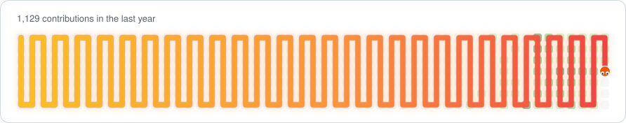

# Ezra Tam

### Stack

### Now

- Building **RavFlow** — AI workflow automation for enterprises
- Into personal AI agents, long-term memory & autonomous coding workflows
- Open to interesting collaborations

### Connect

📧 tam@ravflow.com

### Streak

### Contributions

  

<i>watch it eat through a year of commits</i>

